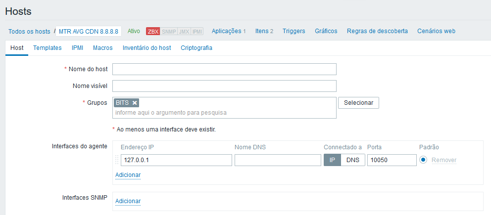
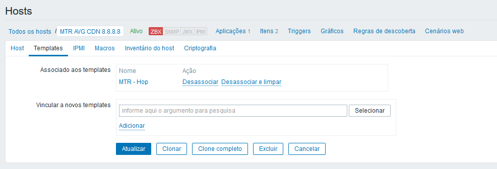
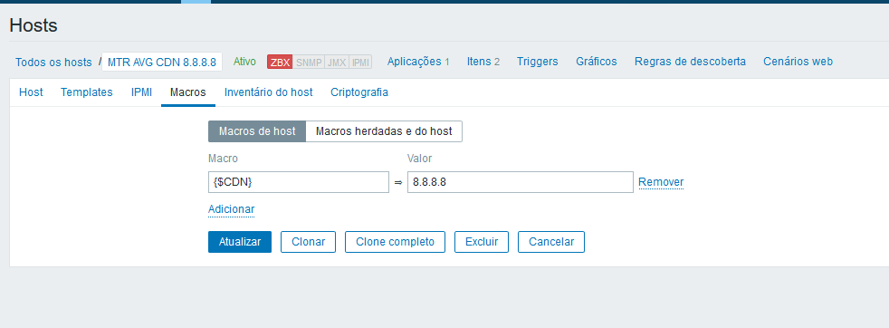

### Prerequisites
- jq
- mtr

### Install MTR Centos
- yum install mtr

### Install MTR Debian/Ubuntu
- apt-get install mtr

Example Use MTR

```sh
# mtr --report -c 5 --json 8.8.8.8
{"src":"ZABBIX","dst":"8.8.8.8","tos":"0x0","packetsize":64,"bitpattern":"0x00","packets":10,"hops":[{"hop":1,"ipaddr":"45.162.228.245","host":"unresolved","drop":1,"received":9,"geomean":1.1,"jitter":0.3,"jitteravg":0.3,"jittermax":0.7,"jitterint":2.1,"losspercent":10.0,"sent":10,"last":1.5,"avg":1.2,"best":0.8,"worst":1.8,"stddev":0.0},{"hop":2,"ipaddr":"187.16.222.90","host":"as15169.saopaulo.sp.ix.br","drop":0,"received":10,"geomean":1.8,"jitter":1.1,"jitteravg":0.3,"jittermax":1.1,"jitterint":2.6,"losspercent":0.0,"sent":10,"last":1.5,"avg":1.8,"best":1.5,"worst":2.5,"stddev":0.0},{"hop":3,"ipaddr":"108.170.245.129","host":"unresolved","drop":0,"received":10,"geomean":2.0,"jitter":0.2,"jitteravg":0.2,"jittermax":0.3,"jitterint":1.5,"losspercent":0.0,"sent":10,"last":2.0,"avg":2.0,"best":1.8,"worst":2.2,"stddev":0.0},{"hop":4,"ipaddr":"72.14.236.201","host":"unresolved","drop":0,"received":10,"geomean":2.0,"jitter":0.2,"jitteravg":0.1,"jittermax":0.2,"jitterint":0.7,"losspercent":0.0,"sent":10,"last":2.3,"avg":2.0,"best":1.9,"worst":2.3,"stddev":0.0},{"hop":5,"ipaddr":"8.8.8.8","host":"dns.google","drop":0,"received":10,"geomean":2.0,"jitter":0.0,"jitteravg":0.1,"jittermax":0.1,"jitterint":0.4,"losspercent":0.0,"sent":10,"last":2.0,"avg":2.0,"best":1.9,"worst":2.1,"stddev":0.0}]}

# mtr --report -c 5 --json 8.8.8.8 | jq
{
  "src": "ZABBIX",
  "dst": "8.8.8.8",
  "tos": "0x0",
  "packetsize": 64,
  "bitpattern": "0x00",
  "packets": 5,
  "hops": [
    {
      "hop": 1,
      "ipaddr": "45.162.228.245",
      "host": "unresolved",
      "drop": 0,
      "received": 5,
      "geomean": 1.5,
      "jitter": 4.9,
      "jitteravg": 1.3,
      "jittermax": 4.9,
      "jitterint": 6.3,
      "losspercent": 0,
      "sent": 5,
      "last": 5.7,
      "avg": 2,
      "best": 0.8,
      "worst": 5.7,
      "stddev": 2
    },
    {
      "hop": 2,
      "ipaddr": "187.16.222.90",
      "host": "as15169.saopaulo.sp.ix.br",
      "drop": 0,
      "received": 5,
      "geomean": 1.6,
      "jitter": 0.3,
      "jitteravg": 0.1,
      "jittermax": 0.3,
      "jitterint": 0.5,
      "losspercent": 0,
      "sent": 5,
      "last": 1.5,
      "avg": 1.6,
      "best": 1.5,
      "worst": 1.7,
      "stddev": 0
    },
    {
      "hop": 3,
      "ipaddr": "108.170.245.129",
      "host": "unresolved",
      "drop": 0,
      "received": 5,
      "geomean": 2.1,
      "jitter": 0,
      "jitteravg": 0.5,
      "jittermax": 1.3,
      "jitterint": 2.3,
      "losspercent": 0,
      "sent": 5,
      "last": 1.8,
      "avg": 2.1,
      "best": 1.8,
      "worst": 3.1,
      "stddev": 0
    },
    {
      "hop": 4,
      "ipaddr": "72.14.236.201",
      "host": "unresolved",
      "drop": 0,
      "received": 5,
      "geomean": 1.9,
      "jitter": 0,
      "jitteravg": 0.1,
      "jittermax": 0.2,
      "jitterint": 0.3,
      "losspercent": 0,
      "sent": 5,
      "last": 1.9,
      "avg": 1.9,
      "best": 1.8,
      "worst": 2.1,
      "stddev": 0
    },
    {
      "hop": 5,
      "ipaddr": "8.8.8.8",
      "host": "dns.google",
      "drop": 0,
      "received": 5,
      "geomean": 2,
      "jitter": 0.1,
      "jitteravg": 0.1,
      "jittermax": 0.2,
      "jitterint": 0.6,
      "losspercent": 0,
      "sent": 5,
      "last": 1.9,
      "avg": 2,
      "best": 1.9,
      "worst": 2.2,
      "stddev": 0
    }
  ]
}

# mtr --report -c 5 --json 8.8.8.8 --aslookup
{"src":"ZABBIX","dst":"8.8.8.8","tos":"0x0","packetsize":64,"bitpattern":"0x00","packets":5,"hops":[{"hop":1,"ipaddr":"45.162.228.245","host":"unresolved","asn": "AS268581","drop":0,"received":5,"geomean":1.6,"jitter":0.3,"jitteravg":1.8,"jittermax":4.4,"jitterint":8.3,"losspercent":0.0,"sent":5,"last":0.9,"avg":2.0,"best":0.9,"worst":5.6,"stddev":1.9},{"hop":2,"ipaddr":"187.16.222.90","host":"as15169.saopaulo.sp.ix.br","asn": "AS???","drop":0,"received":5,"geomean":2.0,"jitter":0.9,"jitteravg":0.3,"jittermax":0.9,"jitterint":1.6,"losspercent":0.0,"sent":5,"last":3.0,"avg":2.0,"best":1.6,"worst":3.0,"stddev":0.5},{"hop":3,"ipaddr":"108.170.245.129","host":"unresolved","asn": "AS15169","drop":0,"received":5,"geomean":2.0,"jitter":0.1,"jitteravg":0.1,"jittermax":0.2,"jitterint":0.5,"losspercent":0.0,"sent":5,"last":2.1,"avg":2.0,"best":1.9,"worst":2.2,"stddev":0.0},{"hop":4,"ipaddr":"72.14.236.201","host":"unresolved","asn": "AS15169","drop":0,"received":5,"geomean":2.0,"jitter":0.1,"jitteravg":0.0,"jittermax":0.1,"jitterint":0.1,"losspercent":0.0,"sent":5,"last":2.0,"avg":2.0,"best":2.0,"worst":2.1,"stddev":0.0},{"hop":5,"ipaddr":"8.8.8.8","host":"dns.google","asn": "AS15169","drop":0,"received":5,"geomean":2.0,"jitter":0.0,"jitteravg":0.1,"jittermax":0.2,"jitterint":0.4,"losspercent":0.0,"sent":5,"last":2.1,"avg":2.0,"best":1.9,"worst":2.1,"stddev":0.0}]}

# mtr --report -c 5 --json 8.8.8.8 --aslookup | jq
{
  "src": "ZABBIX",
  "dst": "8.8.8.8",
  "tos": "0x0",
  "packetsize": 64,
  "bitpattern": "0x00",
  "packets": 5,
  "hops": [
    {
      "hop": 1,
      "ipaddr": "45.162.228.245",
      "host": "unresolved",
      "asn": "AS268581",
      "drop": 0,
      "received": 5,
      "geomean": 1.3,
      "jitter": 0,
      "jitteravg": 0.7,
      "jittermax": 1.8,
      "jitterint": 3.3,
      "losspercent": 0,
      "sent": 5,
      "last": 1.2,
      "avg": 1.4,
      "best": 0.9,
      "worst": 2.7,
      "stddev": 0.7
    },
    {
      "hop": 2,
      "ipaddr": "187.16.222.90",
      "host": "as15169.saopaulo.sp.ix.br",
      "asn": "AS???",
      "drop": 0,
      "received": 5,
      "geomean": 1.9,
      "jitter": 0.1,
      "jitteravg": 0.6,
      "jittermax": 2.4,
      "jitterint": 2.5,
      "losspercent": 0,
      "sent": 5,
      "last": 1.6,
      "avg": 2,
      "best": 1.5,
      "worst": 3.9,
      "stddev": 0.7
    },
    {
      "hop": 3,
      "ipaddr": "108.170.245.129",
      "host": "unresolved",
      "asn": "AS15169",
      "drop": 0,
      "received": 5,
      "geomean": 1.9,
      "jitter": 0,
      "jitteravg": 0,
      "jittermax": 0,
      "jitterint": 0.1,
      "losspercent": 0,
      "sent": 5,
      "last": 1.9,
      "avg": 1.9,
      "best": 1.9,
      "worst": 1.9,
      "stddev": 0
    },
    {
      "hop": 4,
      "ipaddr": "72.14.236.201",
      "host": "unresolved",
      "asn": "AS15169",
      "drop": 0,
      "received": 5,
      "geomean": 1.9,
      "jitter": 0.1,
      "jitteravg": 0.1,
      "jittermax": 0.2,
      "jitterint": 0.4,
      "losspercent": 0,
      "sent": 5,
      "last": 1.8,
      "avg": 1.9,
      "best": 1.8,
      "worst": 2.2,
      "stddev": 0
    },
    {
      "hop": 5,
      "ipaddr": "8.8.8.8",
      "host": "dns.google",
      "asn": "AS15169",
      "drop": 0,
      "received": 5,
      "geomean": 2,
      "jitter": 0.1,
      "jitteravg": 0.1,
      "jittermax": 0.1,
      "jitterint": 0.3,
      "losspercent": 0,
      "sent": 5,
      "last": 2,
      "avg": 2,
      "best": 1.9,
      "worst": 2,
      "stddev": 0
    }
  ]
}
```
Import template ["mtr_json.xml"](https://github.com/brunosantos-shell/mtr_json_zabbix/blob/master/mtr_json.xml)

Configure or create Zabbix Host



Configure Template 	MTR - Hop	 


Configure macro CDN destination
